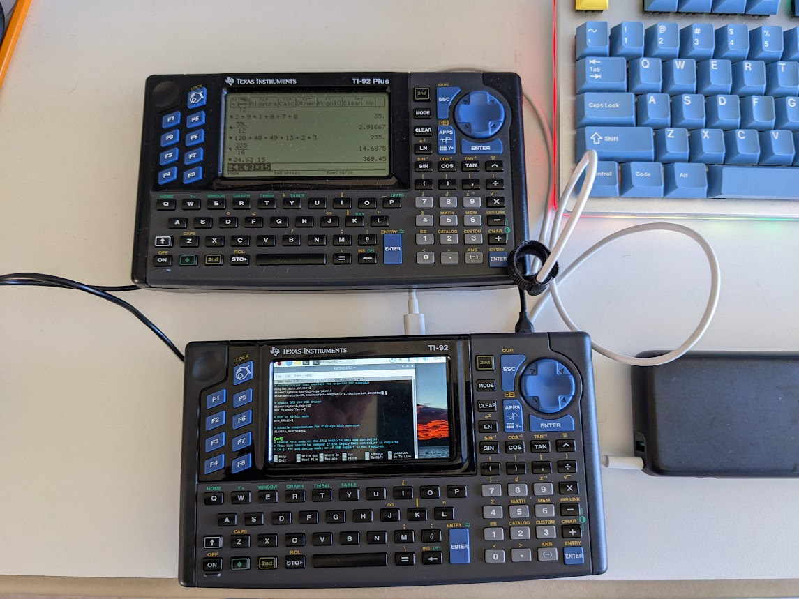
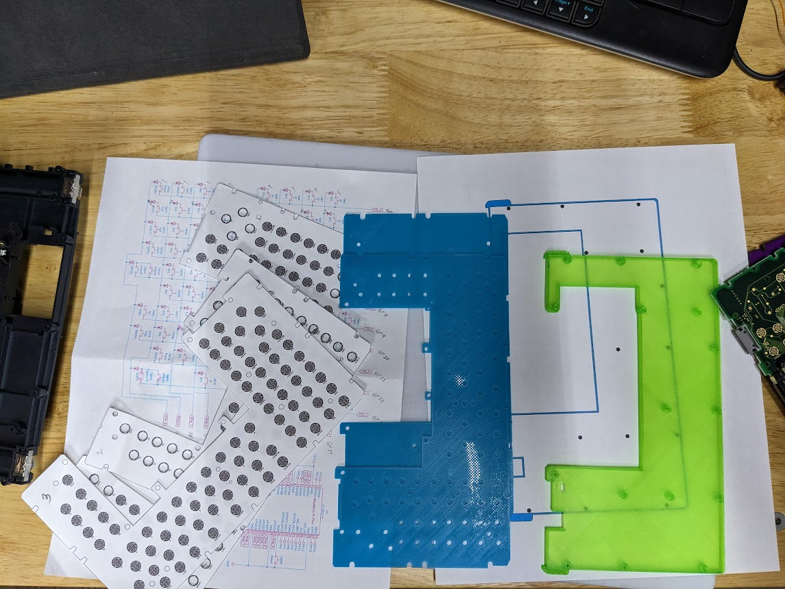
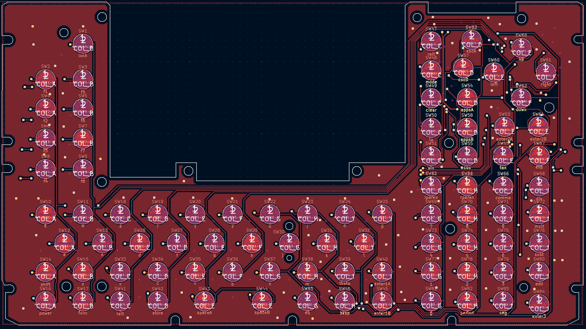
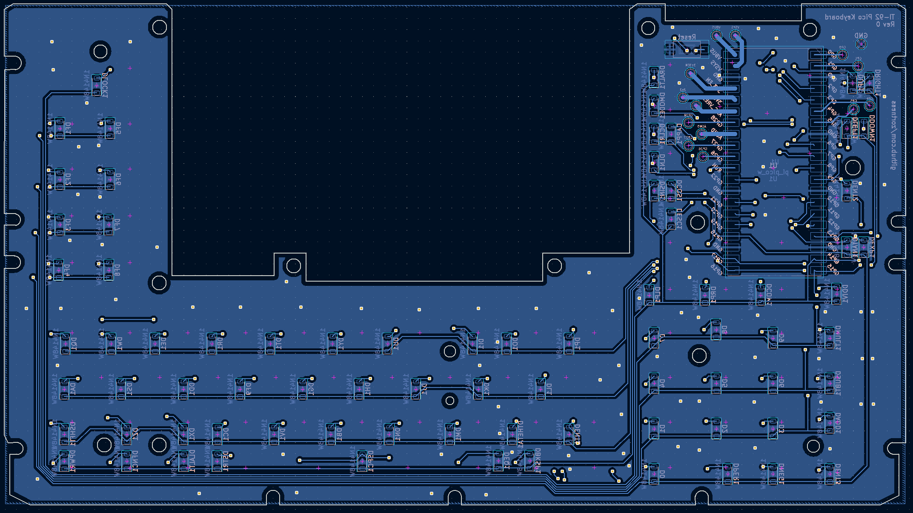
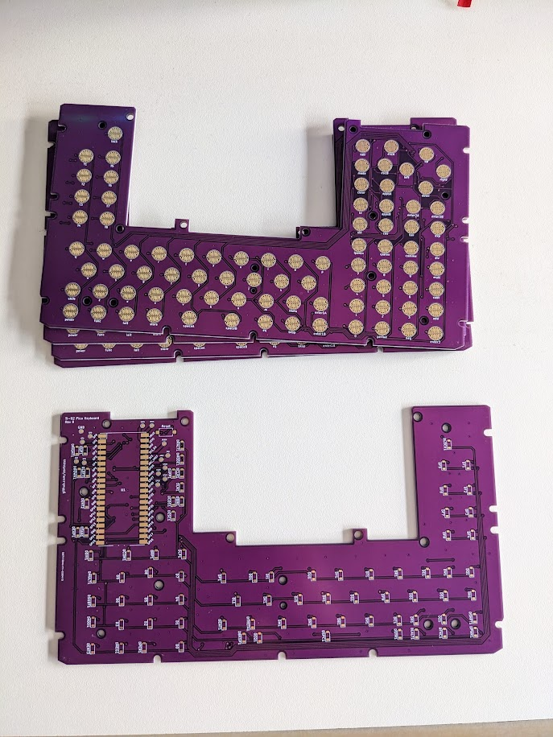

# TI-92 Redux
Bringing the TI-92's back to life.

## Intro
My first graphing calculator and introduction to portable programming was an early TI-85.
I became enamoured with the TI calculators in the 90s, longing for a TI-92 when they were
announced, but never able to purchase one. Now, you can find them in various conditions for
relatively cheap on the internet.

Unfortunately, the most common issues seem to be screen related, and the screens on the TI-92
are not easily repaired. Such was the case with one of the TI-92s I purchased, so I began 
thinking about how I could make use of this iconic chasis. 

I found other projects, notably one seen on Hackaday, the 
[TI-92 Revive project](https://hackaday.io/project/175448-reviving-the-ti-92-calculator-into-a-rpi-pc)
and corresponding [github repo](https://github.com/ccadic/TI92-revive). 
This is a cool project in a similar vein, but I wanted to make some different design decisions.

* First, I wanted the PCB to be as simple as possible for the first attempt, trying to keep to a 
2-layer board. 
* Second, I wanted to have the keyboard to be operable as a standalone unit, in case someone wanted
to use it on another project or different SBC than I chose.
* Third, I wanted to re-use as much of the original TI-92 chasis as possible. A goal which I didn't
meet to the original expectation due to the complexity of the original back plates. 

## Physical Replication Strategy
For several parts of this build, I traced the original components (PCB, back plate, etc) onto a 
piece of paper, then scanned them with a flat bed scanner. I then took the drawings and traced 
them into SVG's set to the correct dimensions using InkScape so I could use them with other tools 
such as KiCad and OpenSCAD. I also printed multiple versions of the PCB and various chasis bits 
on my 3D printer to work toward getting the correct fitment with the original chasis pieces.

Most of the SVGs and drawings are included [here](drawings/).

## PCB Design
The PCB is designed in KiCad 7. The board is designed as a custom keyboard, using a Pi Pico (or Pico W)
as the keybord controller. The routing is all done by hand with an attempt at keeping the jumps minimal.

Note: The PCB has tabs and holes to hold an SBC that lines up with the Raspberry Pi mounting holes.

### BOM And Assembly
* 80 count SOD-123 general purpose diode, [1N4148W-TP](https://www.digikey.com/en/products/detail/micro-commercial-co/1N4148W-TP/717196)
* 1 count [RS-282G05A3 tactile switch](https://www.digikey.com/en/products/detail/c-k/RS-282G05A3-SM-RT/2747190)
* 1 count [Pi Pico W](https://www.digikey.com/en/products/detail/raspberry-pi/SC0918/16608263)

I was able to solder all of this with a relatively large soldering iron and some tweezers.
Tin one of the pads for the component first, then heat it up again and set the part on the pad.
Only solder the second pad when you're happy with the alignment.

I used a Raspberry Pi 4 as my SBC.

To pair with the Pi 4, I used the [Pimoroni Hyperpixel 4.0" Touch Display](https://www.adafruit.com/product/3578).
This display is pretty expensive, but I purchased this a while ago, and noticing it seemed to fit perfectly
into the TI-92 chasis is one of the factors that pushed me into completing this project.

A 4" screen of this ratio fits almost perfectly into the TI-92. 

## Printed Pieces
I used OpenSCAD to assemble the designs for printing. Most of the prints are derived from one or 
more SVG drawings, the back plate being the most complicated.

During development, I dropped my keyboard and had to chase keys across the house multiple times. 
I ultimately ended up finding all of my keys, but there is a basic key file included in case you
need to print one.

## Keyboard Software
I chose the [KMK firmware](https://github.com/KMKfw/kmk_firmware) 
(as opposed to something like [QMK](https://docs.qmk.fm/#/) ) mostly due to ease of use and direct
support for the Pi Pico and Pico W. This has the added bonus of being able to easily reprogram the 
keyboard from the finished device itself, using the keyboard itself to make changes.

Follow the instructions for installing the KMK firmware on the device (basically copy most of the
files included in their release). Then drag and drop the [firmware/code.py](firmware/code.py) file
onto the device and it should be ready to go.

## Power Supply
There is no power supply built into this project. For my personal prototype, I'm using a 
[2x18650 container](https://www.digikey.com/en/products/detail/seeed-technology-co-ltd/114090053/10451921)
with a built-in on/off switch into a cheap buck converter. I also attempted to use a L7805 5V
linear regulator, and while it works, even with a heat sink it will get very hot.

I am currently powering the Pi Pico W through the USB cable that connects it to the Pi 4. 

## Development Software
* [KiCad 7](https://www.kicad.org/)
* [InkScape 1.2](https://inkscape.org/)
* [OpenSCAD](http://openscad.org/)
* [KMK Firmware](https://github.com/KMKfw/kmk_firmware)

## Version History

### 2023-05-19 Rev 0
* PCB Rev 0 - Functional 
  * Some mounting hole misalignments that need to be fixed by hand
* KMK Keyboard Firmware - Functional
  * Will work as a USB keyboard on any modern PC
  * Some QoL improvements need to be made on the mouse functionality
  * Really need BlueTooth support to eliminate the USB cable
* Back Plate - Functional
  * Very basic, you can tape or glue power sources to it if so inclined

